# StreamFlix ReVanced

<p align="center">
  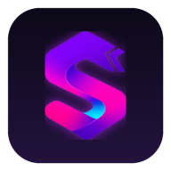
</p>

<p align="center">
  An independently modified Android streaming interface for phones, Android TV, and Google TV.
</p>

<p align="center">
  <a href="https://github.com/PaduU29-SFRV/streamflix-revanced">Repository</a>
  ·
  <a href="https://github.com/PaduU29-SFRV/streamflix-revanced/releases">Releases</a>
  ·
  <a href="https://github.com/streamflix-reborn2/streamflix">Upstream project</a>
  ·
  <a href="https://github.com/PaduU29-SFRV/streamflix-revanced/issues">Issues</a>
</p>

## About this version

This repository is based on [StreamFlix Reborn](https://github.com/streamflix-reborn2/streamflix), which in turn continues the original StreamFlix project by [Lory-Stan TANASI](https://github.com/stantanasi). It is an independent modified/revanced version maintained in its own repository.

It is not guaranteed to be synchronized with upstream. Features, fixes, regressions, providers, behavior, and release timing may differ. An upstream fix may not be present here, and this version may contain changes that upstream does not. When reporting a problem, describe the behavior of this version, including the device, app build, and provider involved; do not assume that upstream behavior applies.

This is not an official upstream release.

## Screenshots

The screenshots below show the current mobile and Android TV interfaces, including title details, season navigation, settings, and Supabase configuration.

<p align="center">
  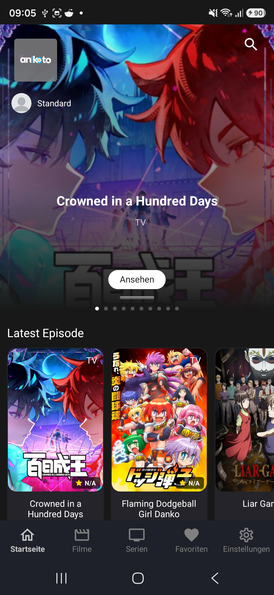
  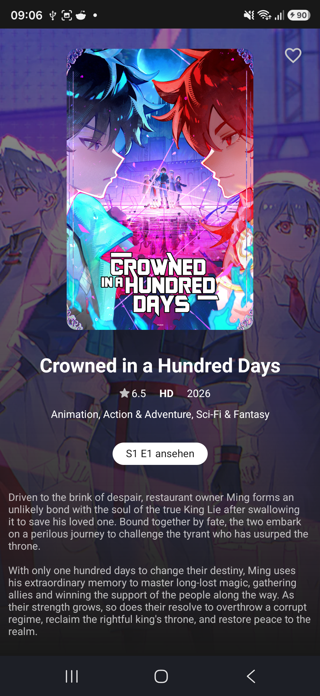
  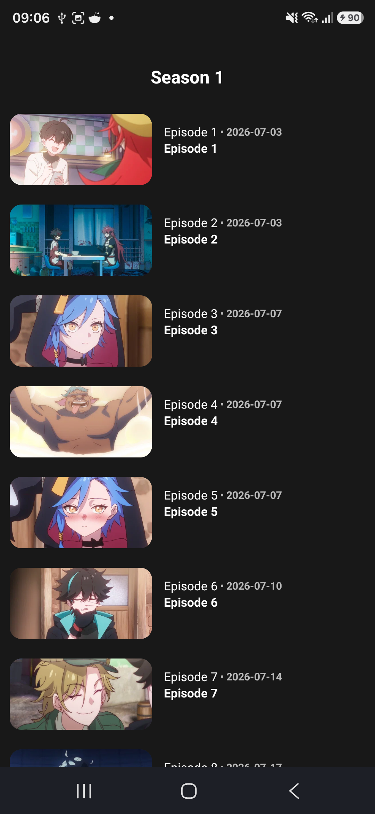
</p>

<p align="center">
  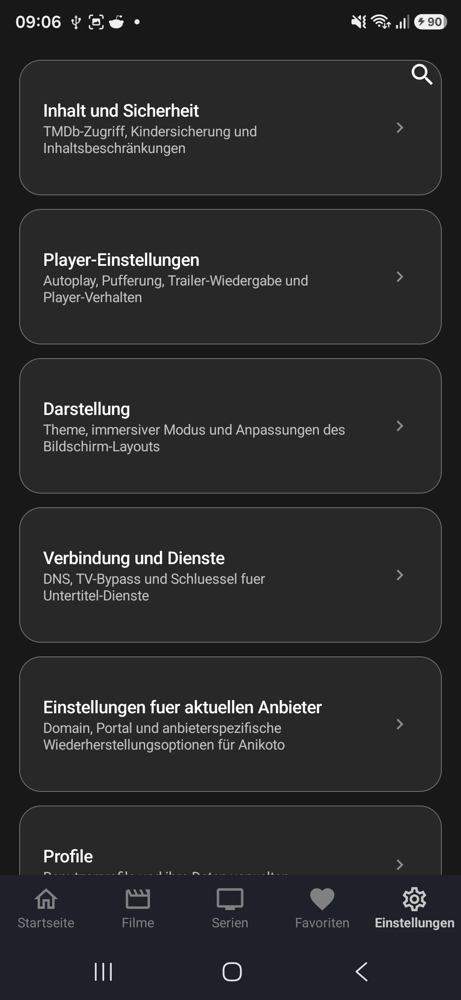
  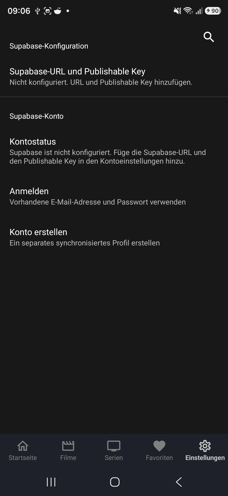
</p>

<p align="center">
  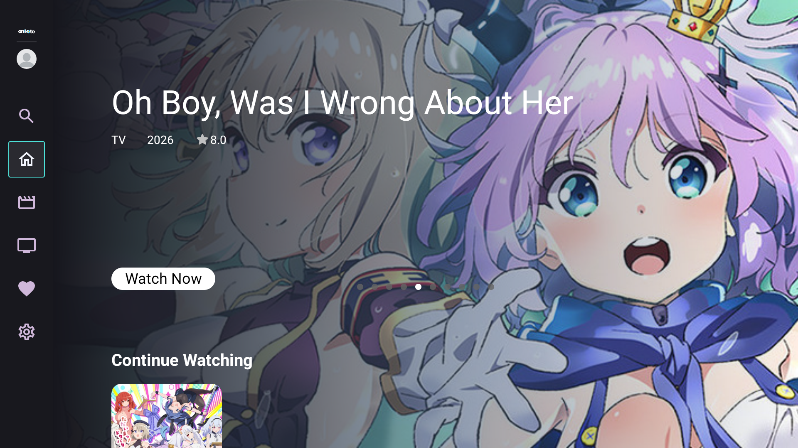
  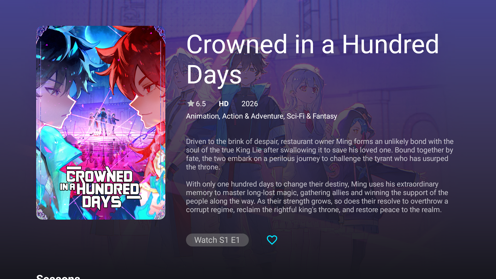
</p>

<p align="center">
  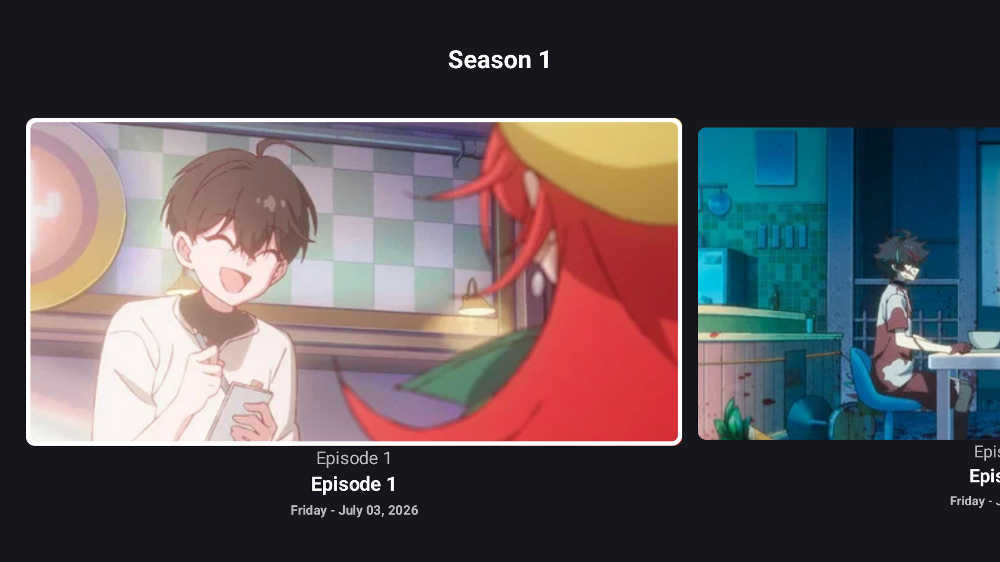
  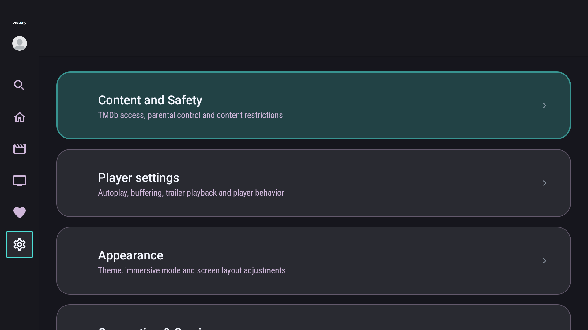
</p>

<p align="center">
  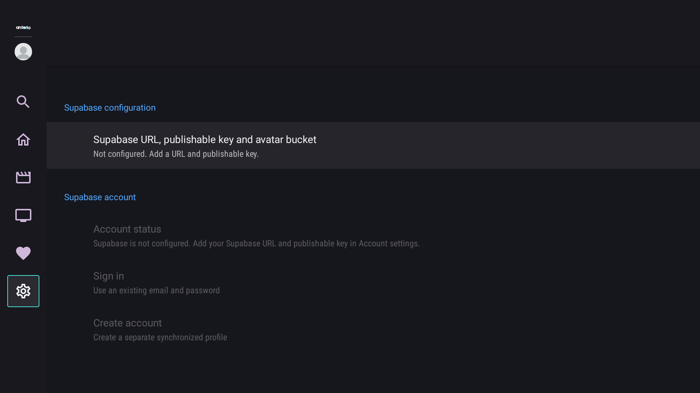
</p>

## What is included

The current codebase includes:

- Separate mobile and Android TV activities, fragments, navigation, focus behavior, and settings screens.
- Home, movie, TV-show, search, favorites, provider, title-details, and playback flows.
- A broad set of provider and extractor integrations. Availability depends on the provider, region, network, and upstream site behavior.
- Local provider databases and backup/restore support for media state.
- Profiles, profile management, parental controls, PIN protection, and per-profile playback/favorite state.
- Media3 playback with HLS/DASH support, subtitle handling, configurable player behavior, decoder fallback, and ten-second seek increments.
- TMDb metadata/search integration, optional subtitle-service integration, DNS-over-HTTPS support, and provider-specific network tools.
- Optional user-configured [Supabase cloud sync](#supabase-cloud-sync). The app validates client-safe keys and does not require cloud sync for the local interface.
- In-app update support and release automation in GitHub Actions.

The app is a streaming interface and provider aggregator: it discovers metadata and stream sources from independent third-party providers and passes playable sources to the Media3 player. This repository does not contain a hosted catalog of video files, and it does not guarantee that any particular provider or title will remain available. Use it only where you have the right to access the content and follow the laws and third-party terms that apply to you.

### Streaming only

StreamFlix ReVanced is designed for streaming. The current application has no user-facing feature for downloading movies, episodes, or other video files, maintaining an offline video library, or exporting a video stream as a permanent local copy. Playback buffering and ordinary HTTP/provider caches are not presented as downloads and are not an offline-video feature.

The code does download subtitles and application updates, and it exports application/user-data backups; those are separate from downloading video content. Provider and extractor implementations may also use endpoint names containing `download` while resolving a playable source. Media delivery remains dependent on independent third-party services, which this project does not control and which may change without notice. Users are responsible for complying with applicable laws, licenses, and third-party terms.

## Installation

Published APKs are distributed through [GitHub Releases](https://github.com/PaduU29-SFRV/streamflix-revanced/releases). When a release is available, open the release and download the APK matching your device:

| Asset pattern | Intended device |
| --- | --- |
| `streamflix-revanced-v<version>.apk` | Universal/default build for phones, tablets, Android TV, and Google TV. |
| `streamflix-revanced-v<version>-only-mobile.apk` | Android phones and tablets. |
| `streamflix-revanced-v<version>-only-tv.apk` | Android TV and Google TV. |

For most users, use the platform-specific asset. The universal APK contains both entry points and selects the appropriate interface at runtime; the mobile-only and TV-only APKs are narrower alternatives.

1. Open the [Releases page](https://github.com/PaduU29-SFRV/streamflix-revanced/releases).
2. Open the release you want to install.
3. Download the matching APK asset listed above.
4. Open or sideload the APK using Android's normal installation flow. Android may ask you to allow installation from the app or file manager you used to open it.
5. Launch StreamFlix ReVanced.

On Android TV or Google TV, transfer the TV APK to the device and open it with an installed file manager or another normal sideloading method. Keep Android's installation and security prompts enabled.

## Automatic updates

When update checks are enabled, StreamFlix ReVanced checks the public GitHub Releases API for `PaduU29-SFRV/streamflix-revanced`. The check and public APK download do not require a GitHub account or GitHub token. The updater ignores drafts and prereleases, compares release tags such as `v1.8.88` with the installed version, and selects the universal, mobile-only, or TV-only asset matching the installed build.

Android still controls installation. After an APK is downloaded and validated, Android may ask you to approve installation from the relevant source; updates are not installed silently.

## Supabase cloud sync

Supabase sync is optional. Local profiles, provider databases, settings, and playback remain usable without it. To synchronize cloud-backed media state between a phone and Android TV, each installation must use the same Supabase project and the same authenticated Supabase account.

> [!IMPORTANT]
> Cross-device sync requires configuring Supabase Email Auth for the app's supported registration flow and initializing the project with all four migration files in [`supabase/migrations/`](./supabase/migrations/) before entering Supabase credentials in the app. In particular, required email confirmation must be disabled because the app does not currently handle the Supabase confirmation callback/deep link.

### 1. Create a Supabase project

Create a Supabase project and obtain its project URL and a client-side key from the project settings/API credentials area. The URL must be HTTPS. The app accepts either:

- a modern `sb_publishable_...` key; or
- a JWT-formatted client key whose decoded role is `anon`.

The Android app uses this key as a client. Never enter a `service_role` key, an `sb_secret_...` key, a database password, or another privileged/server-side credential. Client-configured values must be treated as accessible to the client.

The sync sign-in flow uses Supabase Auth email/password accounts. Ensure the **Email** provider is enabled in the Supabase Dashboard.

#### Configure Email authentication

For the current StreamFlix ReVanced authentication flow, **required email confirmation must be disabled** in the Supabase project. StreamFlix supports direct email/password registration and sign-in, but it does not currently implement the Supabase email-confirmation callback/deep-link flow. If confirmation is required, the registration email can open a callback that does not return the user to a usable StreamFlix authentication flow.

In the Supabase Dashboard, open the Email authentication provider/settings and configure it so that users can sign in without first confirming their email address. Supabase Dashboard labels can change over time, so look for the Email provider option that requires email verification/confirmation before sign-in and disable that requirement.

> [!NOTE]
> This is specific to the current StreamFlix ReVanced authentication implementation, not a general Supabase recommendation. Disabling required email confirmation means ownership of an email address is not verified before that account can be used. If StreamFlix gains a supported confirmation callback/deep-link flow in the future, this requirement can be revisited.

### 2. Initialize the database

Run the following files in the Supabase Dashboard SQL Editor, in this order. They are incremental migrations; do not skip the later files:

1. [`20260722000000_create_user_media_state.sql`](./supabase/migrations/20260722000000_create_user_media_state.sql) creates `public.user_media_state`, its primary key and index, authenticated-user RLS policies, grants, and a timestamp trigger.
2. [`20260723085333_enable_user_media_state_realtime.sql`](./supabase/migrations/20260723085333_enable_user_media_state_realtime.sql) adds `user_media_state` to the `supabase_realtime` publication.
3. [`20260730000000_add_provider_favorites_to_cloud_sync.sql`](./supabase/migrations/20260730000000_add_provider_favorites_to_cloud_sync.sql) extends the allowed media types with `provider_favorite`.
4. [`20260731000000_allow_public_avatar_listing.sql`](./supabase/migrations/20260731000000_allow_public_avatar_listing.sql) adds the public listing policy for the bucket named `Avatars`.

The canonical table is keyed by `(user_id, provider, media_type, media_id)`. It stores movie, TV-show, episode, and provider-favorite state, including favorites, watched state, playback position/history, and the timestamps used when merging changes. `user_id` references `auth.users(id)`. RLS is enabled and the supplied policies permit authenticated users to read, insert, update, and delete only rows whose `user_id` is their own `auth.uid()`.

The migrations do not create an avatar bucket. They also do not configure Supabase Auth provider settings. Those are separate Dashboard/setup tasks described below.

### 3. Configure avatars (optional)

The app does not upload avatar files. It lists image files already present in the configured Storage bucket and builds public object URLs for selected paths. If you want shared custom avatars:

1. Create a Storage bucket in the Supabase Dashboard.
2. Make it public, because the app reads avatars through `/storage/v1/object/public/...`.
3. Upload only the intended `.jpg`, `.jpeg`, or `.png` files. The app recursively lists image files in the bucket.
4. Enter that exact bucket name in the app's **Avatar bucket** field on both devices.
5. Add Storage policies appropriate to your deployment. The supplied migration adds only a public `SELECT`/listing policy for `storage.objects` where `bucket_id = 'Avatars'`; it does not create the bucket or grant uploads.

`Avatars` is the bucket name referenced by the supplied listing policy. The app's bucket field is configurable, but changing it to another name requires an equivalent Storage listing policy for that bucket; the repository SQL does not create that policy automatically. With the field blank, the app shows only its built-in default avatar and does not query Storage.

Because the bucket is public, anyone who can identify an object path can request its public image URL. Do not place private user data in this bucket. The app does not provide an upload workflow, so an upload policy is not required for the app itself; do not add broad anonymous upload or overwrite policies just to complete sync.

### 4. Configure each StreamFlix installation

On both the phone and TV, open **Settings → Account & sync → Supabase configuration**. The same screen is available in the mobile and TV settings flows. Enter:

| Field | Value |
| --- | --- |
| **Supabase URL** | The HTTPS URL of the same Supabase project. |
| **Publishable or anon key** | The client-safe key accepted by the app. |
| **Avatar bucket (optional)** | The exact public Storage bucket name, if using custom avatars. |

Tap **Save**. The app validates the URL and key locally; it rejects secret/service-role keys. Under **Account & sync**, use **Create account** or **Sign in**, then **Sync now** to explicitly upload local changes and download changes from the cloud. Changing the Supabase configuration signs out cloud accounts, clears queued cloud mutations, and keeps local media data; configure the intended project before testing synchronization.

### 5. Connect a phone and TV

```text
Android phone ───┐
                 ├── same Supabase project + same Auth account ── user_media_state
Android TV ──────┘
```

Configure the same URL, client key, and avatar bucket on both devices. Then sign in with the same Supabase email/password account on the local profile that should use the shared state. The association is not made by matching device IDs: cloud rows are owned by the Supabase Auth `user_id`, while each installation still has its own local profile ID and local databases. A Supabase account can be linked to one local profile at a time on a device; reconnecting an account to a different local profile is rejected rather than silently discarding that profile's local state.

### What synchronizes

| Data | Synced | Notes |
| --- | --- | --- |
| Movie favorites and watched state | Yes | Stored as `media_type = movie`, per provider and title. |
| TV-show favorites and last-played state | Yes | Includes last played episode metadata. |
| Episode watched state and playback history | Yes | Includes position, duration, and engagement timestamps. |
| Provider favorites | Yes | Stored as `media_type = provider_favorite`. |
| Profile names, PINs, and profile controls | No | These remain in the local profile store. |
| App settings and provider databases | No | These remain local to each installation. |
| Avatar selection | No | The selected path is local; the referenced public image must exist in the configured bucket. |
| Video files or offline copies | No | The app has no video-download/offline library feature. |

Rows are profile-scoped locally and user-scoped remotely. The sync worker queues local mutations in app storage while offline and retries when a network is available. Realtime updates are subscribed to for the active authenticated user; **Sync now** is available for manual verification.

### Initial sync, updates, and conflicts

On the first sign-in for a local profile, the app fetches the remote rows and merges them with eligible local state belonging to that same cloud account, then uploads the merged local keys. It does not silently merge local state already claimed by a different cloud account; that case signs out and reports an account-data conflict. Once an account is already linked, normal startup sync applies cloud state rather than re-importing all local data as a new first-login merge.

The merge is field-aware and timestamp-based. Favorites preserve positive state, watched state can be cleared by a newer state, and the newest engagement/playback/history values are selected. An offline queued mutation is uploaded only when its state timestamps are not older than the remote row; stale queued mutations are acknowledged without overwriting newer remote progress. The implementation does not promise an application-wide conflict rule for data outside the synchronized media-state rows.

To verify the setup, initialize the four migrations, configure and sign in on the phone, favorite a title or change a movie's watched state, tap **Sync now**, then configure the same project/account on the TV and tap **Sync now** there. Confirm that the same provider/title state appears. Repeat with the TV offline and synchronize after reconnecting to verify queued delivery.

### Troubleshooting

| Problem | Check |
| --- | --- |
| Configuration is rejected | Use an HTTPS project URL and a `sb_publishable_...` or legacy `anon` client key; never use a secret/service-role key. |
| Database or relation error | Run all four migration files in chronological order, including the provider-favorites migration. |
| Registration email opens an unusable callback, or a newly created account cannot sign in | Confirm Email Auth is enabled and that required email confirmation is disabled for the current StreamFlix authentication flow. |
| Sign-in works but sync fails | Confirm Email Auth is enabled, required email confirmation is disabled, the correct account is being used, and the active local profile is the intended one. |
| Permission denied or no rows | Confirm the table RLS policies and authenticated grants from the first migration were applied; do not disable RLS. |
| Avatars do not appear | Confirm the bucket is public, the configured name matches exactly, image paths use a supported extension, and the matching listing policy exists. |
| Phone and TV disagree | Check that URL, key, bucket, Supabase Auth account, local profile choice, and the explicit **Sync now** action all match. |
| Changes do not appear immediately | Realtime requires the second migration and a connected authenticated session; use **Sync now** after reconnecting. |

The supplied SQL intentionally scopes media rows to authenticated users, but avatar storage is public by design and the repository does not supply bucket creation/upload policies. Review those Storage decisions in your own Supabase project before using it with personal or sensitive images.

## Differences from upstream

This is not an exhaustive changelog, but the repository history and current source establish several meaningful areas of divergence from upstream:

- Profile management has been extended with profile-scoped state and PIN-related controls.
- Supabase configuration, including the avatar bucket, is configurable through settings rather than being treated as a single fixed deployment configuration.
- TMDb configuration supports a build-time key pool in addition to the existing single-key setting.
- Recent provider work includes additional provider/extractor aliases and provider-specific recovery behavior.
- Home refresh and TV focus behavior have received local stability changes, and backup/restore covers provider media databases.

These differences can change over time. Consult this repository's commits and issue tracker for the version you are using; do not treat the upstream changelog as the changelog for this fork.

## Supported platforms

- Android phones and tablets: the mobile layout is selected with `APP_LAYOUT=mobile`.
- Android TV and Google TV: the TV layout is selected with `APP_LAYOUT=tv` and uses Android TV/Leanback components.
- A default build includes the shared application manifest and both mobile and TV entry points. Release automation also produces mobile-only and TV-only APK variants.
- The current application targets Android API 35, compiles against API 36, and declares a minimum Android API level of 21. Actual provider and playback compatibility varies by device and Android version.

## Building from source

### Run from Android Studio

1. Install Android Studio and an Android SDK that can provide the project's compile/target platforms.
2. Clone this repository and open it in Android Studio.
3. Create a local `local.properties` file. It is intentionally ignored by Git and must never be committed.
4. Provide the build-time configuration required by your environment. The current Gradle configuration supports these properties:

   ```properties
   APP_LAYOUT=mobile
   TMDB_API_KEY=replace-with-a-key-you-control
   TMDB_API_KEYS=replace-with-comma-separated-keys-you-control
   SUBDL_API_KEY=replace-with-a-key-you-control
   RABBITSTREAM_SOURCE_API=replace-with-a-value-you-control
   ```

   `APP_LAYOUT` may be omitted for the universal/default build, or set to `mobile` or `tv` for a platform-specific build. `TMDB_API_KEYS` is an optional comma-separated pool; `TMDB_API_KEY` is the single-key fallback. `SUBDL_API_KEY` and `RABBITSTREAM_SOURCE_API` configure optional integrations used by the current source. These values are compiled into the app when supplied, so use keys you control and treat the resulting APK as client-exposed. Do not copy credentials from another checkout, commit them, or publish them in screenshots. Cloud sync is configured by users in the app's settings; do not put a Supabase service-role or secret key in the app or in `local.properties`.
5. Select a phone, Android TV, or Google TV device and run the appropriate application variant from Android Studio.

For cross-device sync, complete [Supabase cloud sync](#supabase-cloud-sync) first. Entering credentials in Settings alone is not enough: the database migrations, authenticated account, and any optional public avatar bucket must also be configured.

The release workflow expects the corresponding build values and signing material as GitHub Actions secrets and creates signed universal, mobile-only, and TV-only APK assets.

For a local command-line release build, use `./gradlew assembleRelease` after configuring `local.properties`. The release workflow uses the same task for each layout.

## Known limitations

- Third-party providers can change, disappear, require authentication, block traffic, or return different results by country and network. A provider failure is not necessarily an application failure.
- Playback depends on the returned stream, extractor, device codecs, DRM requirements, and network conditions.
- The TV and mobile builds use different UI entry points; a layout or focus issue on one platform may not reproduce on the other.
- The exact provider set and behavior are version-specific. This project does not promise parity with upstream or with any previous release.

## Reporting issues

Before opening an issue, check whether the problem is provider- or device-specific and reproduce it on this repository's current build. Include:

- app version or commit;
- mobile or TV device and Android version;
- provider, title, season/episode, and language where relevant;
- reproduction steps and a redacted log excerpt.

Never attach API keys, tokens, account credentials, private URLs, or unredacted screenshots.

## Legal disclaimer

StreamFlix ReVanced is an independent software project. It provides an interface for discovering metadata and accessing stream sources made available by independent third-party services. The project does not host, store, or distribute a catalog of movies, television episodes, or other video content. Those third-party media sources and services are not operated or controlled by this project, and their availability, licensing, legality, and terms may differ by service and jurisdiction.

As described in [Streaming only](#streaming-only), StreamFlix ReVanced does not provide a user-facing feature for downloading movies or television episodes, maintaining an offline video library, or exporting playable video streams as permanent local video copies. Subtitle downloads, application-update APK downloads, application/user-data backups, normal playback buffering or cache, and provider or extractor endpoint names containing words such as `download` are separate functions and are not video-download functionality.

Users are responsible for ensuring that their use of the application and any third-party services complies with applicable laws, licenses, and third-party terms. The project does not grant rights to copyrighted third-party works and does not endorse or encourage copyright infringement or unauthorized access to copyrighted material. Use authorized or licensed sources where applicable.

## Legal notice

This software is provided on an "as is" basis subject to the [Apache License 2.0](./LICENSE). The project does not claim ownership of third-party media or other third-party content. Third-party trademarks, service names, metadata, and other third-party materials remain associated with their respective owners where applicable.

References to third-party services do not imply sponsorship, endorsement, partnership, or affiliation. The project does not control the operation, availability, licensing, content, or policies of independent third-party providers, which may change, restrict access, or disappear independently of this project. Nothing in this README constitutes legal advice.

## Credits and relationship to upstream

This project is an independent derivative of [StreamFlix Reborn](https://github.com/streamflix-reborn2/streamflix). The upstream project credits [Lory-Stan TANASI](https://github.com/stantanasi) as the original StreamFlix creator. Please review the upstream repository and the files in this repository for additional third-party notices and attribution.

## License

This project is distributed under the [Apache License 2.0](./LICENSE), subject to the notices and attribution included in the repository. Third-party providers and content sources may have their own terms; this project does not grant rights to content accessed through them.
